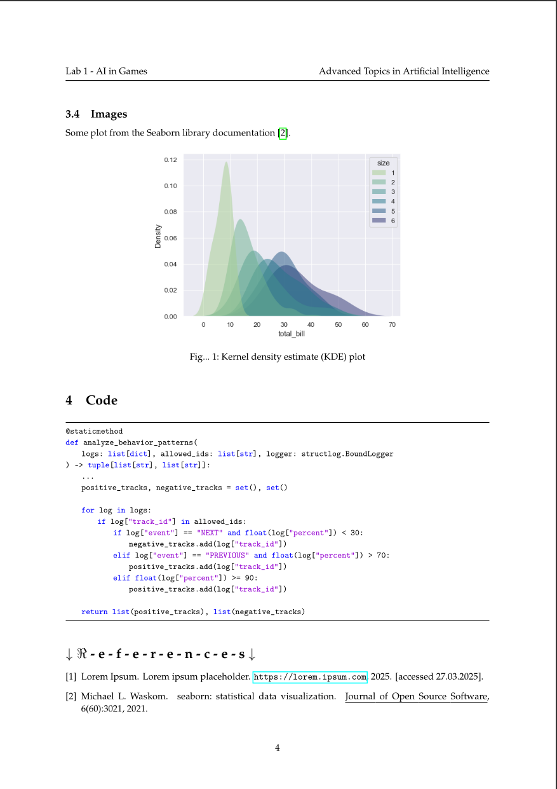

# LaTeX template for short reports at Wrocław University of Science and Technology

<!-- BADGES -->
<p align="left">
   <a href="https://github.com/Krisenberg/pwr-report-template/LICENSE"></a>
   <a href="https://www.repostatus.org/lifecycle"></a>
</p>


## Why?
This LaTeX template is designed to help other students create more academic-style short reports with ease. It ensures **consistent formatting and easy customization**, making it ideal for lab class reports.

> [!NOTE]  
> This is not a template for an academic research paper or an Engineering / Master thesis!


## Table of Contents
- [Preview](#preview)  
- [Project Structure](#project-structure)  
- [Setup](#setup)  
- [Contribution](#contribution) 
- [License](#license) 


## Preview




## Project Structure  
```
pwr-report-template/
│── 📁 examples/       # Rendered example report, preview screenshots 
│── 📁 images/         # Folder for logos and figures
│── 📄 pwrReport.cls   # Custom LaTeX class file
│── 📄 references.bib  # Bibliography file (optional)
│── 📄 report.tex      # Main LaTeX document
│── 📄 section_one.tex # Example section file (optional)
```


## 🔧 Setup
### 1. Install LaTeX
Ensure you have a LaTeX distribution installed:  
- [TeX Live](https://www.tug.org/texlive/) (Linux/Windows/macOS)  
- [MiKTeX](https://miktex.org/) (Windows)  
- [MacTeX](https://www.tug.org/mactex/) (macOS)  

### 2. Compile  
Use a LaTeX editor like **Overleaf**, **TeXworks**, or **VS Code** with LaTeX Workshop. Compile with:  
```sh
pdflatex report.tex   # or use a LaTeX editor's build button
```

### 3. Customize your report  
Edit the `report.tex` file to update the following fields:
```latex
% -------------------- Title Page Information --------------------
\title{Your Report Title}
\titleShort{Short Title}
\courseName{Course Name}
\courseNameShort{CName}  % Shortened course name (if needed)
\author{Your Name}
\date{Submission Date}
```

Modify other elements like **logos**, **figure/table names** etc.:
```latex
% -------------------- Customization --------------------
\tableOfContentsName{My Custom ToC}  % Custom name for Table of Contents
\referencesName{Custom references} % Custom References name
\figureName{Custom fig.}  % Custom figure name
\tableName{Custom tab. name}  % Custom table name
\titlePageLogoLeft{images/pwr/logo_pwr.png}  % Left logo on title page
\titlePageLogoRight{images/pwr/logo_wit.png} % Right logo on title page
\tableOfContentsNameTopMargin{3cm}  % Adjusts top margin for TOC
```


## Contribution
If you have suggestions or improvements, feel free to contribute


## License  
This template is released under the **MIT License** - see the [LICENSE](LICENSE) file for details.
